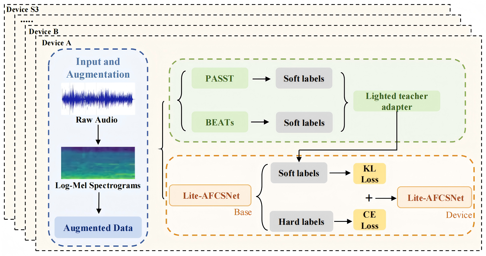
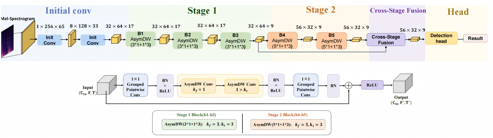

# Lite-AFCSNet

**Official repository for the paper "Lite-AFCSNet: An Ultra-Lightweight Asymmetric Freuency-Aware Cross-Stage Fusion Network For Acoustic Scence Classification**

## Quik Link

- **DCASE 2025 Challenge**:[https://dcase.community/challenge2025/task-low-complexity-acoustic-scene-classification-with-device-information](https://dcase.community/challenge2025/task-low-complexity-acoustic-scene-classification-with-device-information)

## Overview

We propose Lite-AFCSNet, an ultra-lightweight asymmetric frequency-aware cross-stage fusion network for efficient acoustic scene classification. On DCASE 2025 Task 1, Lite-AFCSNet achieves **56.81% macro-average accuracy**
with only **17.23K parameters and 9.67 MMACs**, outperforming the baseline by 6.09 percentage points. Deployed on an STM32H743 MCU, it processes neural network latency in **329.1 ms (RTF = 0.402)**, enabling real-time on-device inference.

<div align="center">
  
  <p><i>The pipeline of the proposed method.</i></p>
</div>

<div align="center">
  
  <p><i>Architecture of Lite-AFCSNet. The upper part shows the overall network, while the lower part illustrates basic blocks.</i></p>
</div>

<div align="center">
  
  <p><i>The proposed pooling-aligned cross-stage fusion module with LC-AFF.</i></p>
</div>

## Repository Structure
This repository is divided into three parts: the first is model training, the second is DCASE official submission and packaging, and the third is model deployment.
```
Lite-AFCSNet/
├── Train                        ← Model Training Folder
├── DACSE_T1_submission          ← DCASE official submission and packaging Folder
└── DACSE_H743_Deployment        ← Model Deployment Folder
```
### Train
```
Train/
├── dataset/                        
│   └── dcase25                   ← 
├── DCASE2025_Task1               ←
│   ├── 90055w1k/                 ←
│   └── st5o8bcr/                 ← 
├── helpers/
│   ├── init.                     ←
│   ├── complexity.py             ←
│   └── utils.py                  ←
├──models/
│   ├── helpers/
│   │   └── utils.py              ← 
│   ├── fusion.py                 ←
│   ├── multi_device_model.py     ←
│   └── net.py                    ←

├──get.py                         ←
├── specaugment.py                ←
├── train_base.py                 ←
├── train_device_specific.py      ←
```
### DACSE_T1_submission
### DACSE_H743_Deployment
```
DCASE_H743_Delivery/
├── README.md                        ← 本文档（使用说明）
├── firmware/                        ← 板端固件（Keil MDK 工程，二选一烧录）
│   ├── deploy_h743_64MHz/           ← ① 64MHz 稳定版（HSI 直跑，最保守）
│   └── deploy_h743_480MHz/          ← ② 480MHz 高性能版（HSE+PLL 超频）
├── pc_tools/                        ← PC 端工具（Python 脚本 + 测试样本）
│   ├── dcase_batch_test.py          ←   一键实测 10 类准确率（最常用）
│   ├── dcase_fetch.py               ←   从 Zenodo 下载官方音频样本
│   ├── pc_onnx_test.py              ←   PC 端 ONNX 对照实验
│   ├── dump_logmel.py               ←   板端 DSP 中间结果抓取
│   ├── check_board_logmel.py        ←   板端 vs PC logmel 一致性检查
│   ├── compare_logits.py            ←   板端 vs PC 分类概率对比
│   ├── reset_and_test.py            ←   pyocd 复位 + 单样本测试
│   ├── send_pcm.py                  ←   手动发送一段音频
│   ├── check_pcm.py                 ←   样本预处理检查
│   ├── check_filterbank.py          ←   mel 滤波器组检查
│   └── dataset/samples/*.wav        ←   10 类测试样本（每类 1 个）
└── model/
    └── asc_base_p0_65_int8_qdq.onnx ← int8 量化模型（QDQ 格式）
```


## Getting Started

1. Clone this repository.
2. Create and activate a [conda](https://docs.anaconda.com/free/miniconda/index.html) environment:

```
conda create -n d25_t1 python=3.13
conda activate d25_t1
```

3. Install [PyTorch](https://pytorch.org/get-started/previous-versions/) version that suits your system. For example:

```
# for example:
pip3 install torch torchvision torchaudio --index-url https://download.pytorch.org/whl/cu118
# or for the most recent versions:
pip3 install torch torchvision torchaudio
```

4. Install requirements:

```
pip3 install -r requirements.txt
```

5. Download and extract the [TAU Urban Acoustic Scenes 2022 Mobile, Development dataset](https://zenodo.org/records/6337421).

You should end up with a directory that contains, among other files, the following:
* A directory *audio* containing 230,350 audio files in *wav* format
* A file *meta.csv* that contains 230,350 rows with columns *filename*, *scene label*, *identifier* and *source label*

6. Specify the location of the dataset directory in the variable *dataset_dir* in file [dataset/dcase25.py](dataset/dcase25.py).
7. If you have not used [Weights and Biases](https://wandb.ai/site) for logging before, you can create a free account. On your
machine, run ```wandb login``` and copy your API key from [this](https://wandb.ai/authorize) link to the command line.

## Training Process

After training a **general model** in Step 1, you can fine-tune it for specific devices (Step 2).  

### Full Device-specific Fine-Tuning

**Step 1:** Train a **general model** on the full training set to maximize cross-device generalization.

```
python train_base.py
```

**Step 2:** Load the pre-trained model from **Step 1** and fine-tune for all devices in the training set (`a`, `b`, `c`, `s1`, `s2`, `s3`):

```
python train_device_specific.py --ckpt_id=<wandb_id_from_Step_1>
```

**How to specify the checkpoint?** Simply pass the Weights & Biases experiment ID (wandb_id_from_Step_1). You can find it in the Weights & Biases online dashboard.

**Hint:** When inspecting **curves** in Weights & Biases, make sure to set the **x-axis to `trainer.global_step`** instead of the default `step`. This ensures that metrics are correctly aligned across different device-specific fine-tuning phases. The default `step` counter is **shared across all phases** because a **single Weights & Biases logger instance is reused**, causing offsets in the plots.


## **Data Splits**

A detailed description of the data splits (**train, test, and evaluation sets**) is available on the [official task description page](https://dcase.community/challenge2025/).

### **Training Data Restrictions**
This year's training set is limited to a **subset** of the full **development-train split** from the [TAU Urban Acoustic Scenes 2022 Mobile, Development dataset (TAU)](https://zenodo.org/records/6337421). Specifically:
- The subset aligns with the **25% split from DCASE 2024 Task 1**.
- **Training on any other part of the TAU dataset (beyond the allowed 25% subset) is strictly prohibited** and will result in **disqualification** from the challenge. The **development-test** split can only be used to **evaluate** the system's performance.

### **Use of External Datasets**
✅ **Allowed:** Participants may use **any publicly available dataset** to improve their models.  
🚨 **Requirement:** **All external datasets must be declared to the organizers by May 18, 2025.**  

If you would like to suggest additional external resources, please contact:  
📩 **Florian Schmid** (florian.schmid@jku.at). 


## Baseline Complexity

The Baseline system (full fine-tune strategy) has a complexity of 61,148 parameters and 29.42 million MACs. The table below lists how the parameters
and MACs are distributed across the different layers in the network.

**According to the challenge rules the following complexity limits apply**:
* max memory for model parameters: 128 kB (Kilobyte)
* max number of MACs for inference of a 1-second audio snippet: 30 million MACs

**Model parameters may vary across different devices. As a result, the complexity limits apply individually to each device-specific model, rather than the total sum of all models.**

Model parameters of the baseline must be converted to 16-bit precision before inference of the test/evaluation set to stick to the complexity limits (61,148 * 16 bits = 61,148 * 2 B = 122,296 B <= 128 kB).

In previous years of the challenge, top-ranked teams used a technique called **quantization** that converts model paramters to 8-bit precision. In this case,
the maximum number of allowed parameters would be 128,000.


| **Description**       | **Layer**                        | **Input Shape** | **Params** | **MACs**  |
|-----------------------|----------------------------------|-----------------|------------|-----------|
| in_c[0]               | Conv2dNormActivation             | [1, 1, 256, 65] | 88         | 304,144   |
| in_c[1]               | Conv2dNormActivation             | [1, 8, 128, 33] | 2,368      | 2,506,816 |
| stages[0].b1.block[0] | Conv2dNormActivation (pointwise) | [1, 32, 64, 17] | 2,176      | 2,228,352 |
| stages[0].b1.block[1] | Conv2dNormActivation (depthwise) | [1, 64, 64, 17] | 704        | 626,816   |
| stages[0].b1.block[2] | Conv2dNormActivation (pointwise) | [1, 64, 64, 17] | 2,112      | 2,228,288 |
| stages[0].b2.block[0] | Conv2dNormActivation (pointwise) | [1, 32, 64, 17] | 2,176      | 2,228,352 |
| stages[0].b2.block[1] | Conv2dNormActivation (depthwise) | [1, 64, 64, 17] | 704        | 626,816   |
| stages[0].b2.block[2] | Conv2dNormActivation (pointwise) | [1, 64, 64, 17] | 2,112      | 2,228,288 |
| stages[0].b3.block[0] | Conv2dNormActivation (pointwise) | [1, 32, 64, 17] | 2,176      | 2,228,352 |
| stages[0].b3.block[1] | Conv2dNormActivation (depthwise) | [1, 64, 64, 17] | 704        | 331,904   |
| stages[0].b3.block[2] | Conv2dNormActivation (pointwise) | [1, 64, 64, 9]  | 2,112      | 1,179,712 |
| stages[1].b4.block[0] | Conv2dNormActivation (pointwise) | [1, 32, 64, 9]  | 2,176      | 1,179,776 |
| stages[1].b4.block[1] | Conv2dNormActivation (depthwise) | [1, 64, 64, 9]  | 704        | 166,016   |
| stages[1].b4.block[2] | Conv2dNormActivation (pointwise) | [1, 64, 32, 9]  | 3,696      | 1,032,304 |
| stages[1].b5.block[0] | Conv2dNormActivation (pointwise) | [1, 56, 32, 9]  | 6,960      | 1,935,600 |
| stages[1].b5.block[1] | Conv2dNormActivation (depthwise) | [1, 120, 32, 9] | 1,320      | 311,280   |
| stages[1].b5.block[2] | Conv2dNormActivation (pointwise) | [1, 120, 32, 9] | 6,832      | 1,935,472 |
| stages[2].b6.block[0] | Conv2dNormActivation (pointwise) | [1, 56, 32, 9]  | 6,960      | 1,935,600 |
| stages[2].b6.block[1] | Conv2dNormActivation (depthwise) | [1, 120, 32, 9] | 1,320      | 311,280   |
| stages[2].b6.block[2] | Conv2dNormActivation (pointwise) | [1, 120, 32, 9] | 12,688     | 3,594,448 |
| ff_list[0]            | Conv2d                           | [1, 104, 32, 9] | 1,040      | 299,520   |
| ff_list[1]            | BatchNorm2d                      | [1, 10, 32, 9]  | 20         | 20        |
| ff_list[2]            | AdaptiveAvgPool2d                | [1, 10, 32, 9]  | -          | -         |
| **Sum**               | -                                | -               | **61,148**     | **29,419,156** |

To give an example on how MACs and parameters are calculated, let's look in detail into the module **stages[0].b3.block[1]**.
It consists of a conv2d, a batch norm, and a ReLU activation function. 

**Parameters**: The conv2d Parameters are calculated as *input_channels * output_channels * kernel_size * kernel_size*, resulting in 
1 * 64 * 3 * 3 = 576 parametes. Note that *input_channels=1* since it is a depth-wise convolution with 64 groups. The batch norm adds 64 * 2 = 128 parameters
on top, resulting in a total of 704 parameters for this *Conv2dNormActivation* module.

**MACs**: The MACs of the conv2d are calculated as *input_channels * output_channels * kernel_size * kernel_size * output_frequency_bands * output_time_frames*, resulting in 1 * 64 * 3 * 3 * 64 * 9 = 331,776 MACs.   
Note that *input_channels=1* since it is a depth-wise convolution with 64 groups. The batch norm adds 128 MACs
on top, resulting in a total of 331,904 MACs for this *Conv2dNormActivation* module.

## Baseline Results

The primary evaluation metric for the DCASE 2024 challenge Task 1 is **Macro Average Accuracy** (class-wise averaged accuracy).

The two tables below list the Macro Average Accuracy, class-wise accuracies and device-wise accuracies for the general model (Step 1), and the fine-tuned device-specific models (Step 2). The results are averaged over 4 runs.
You should obtain similar results when running the baseline system. 


### Class-wise results

| **Model**              | **Airport** | **Bus** | **Metro** | **Metro Station** | **Park** | **Public Square** | **Shopping Mall** | **Street Pedestrian** | **Street Traffic** | **Tram** | **Macro Avg. Accuracy** |
|------------------------|------------:|--------:|----------:|------------------:|---------:|------------------:|------------------:|----------------------:|-------------------:|---------:|:-----------------------:|
| General Model          |       38.94 |   62.28 |     40.60 |             50.72 |    72.03 |             29.20 |             56.04 |                 34.76 |             73.21  |    49.42 |      50.72 ± 0.47       |
| Device-specific Models |       44.43 |   64.81 |     43.87 |             48.22 |    72.75 |             32.04 |             53.14 |                 34.43 |             74.10  |    51.08 |    **51.89 ± 0.05**     |


### Device-wise results

| **Model**              | **A** | **B** | **C**     | **S1**    | **S2** | **S3**    | **S4**    | **S5** | **S6**    | **Macro Avg. Accuracy** |
|------------------------|:-----:|:-----:|:---------:|:---------:|:------:|:---------:|:---------:|:------:|:---------:|:-----------------------:|
| General Model          | 62.80 | 52.87 |  54.23    |  48.52    | 47.29  |  52.86    |  48.14    | 47.23  |  42.60    |      50.72 ± 0.47       |
| Device-specific Models | 63.98 | 55.85 |  59.09    |  48.68    | 48.74  |  52.72    |  48.14    | 47.23  |  42.60    |    **51.89 ± 0.05**     |

Note that results for devices (`s4`, `s5`, `s6`) are the same for *General Model* and *Device-specific Models*, as the *General Model* is used for unknown devices (devices that are not in the training set).

## Obtain Evaluation Set Predictions

The evaluation set will be released on **June 1st**. Detailed instructions on generating predictions for the evaluation set will be provided alongside its release.

## Inference Code

For this year's challenge, participants must submit inference code for their models. Inference code must be provided in the form of a simple installable python package. The inference package for the baseline system will be soon provided in a separate repository.


